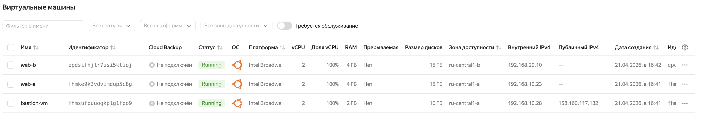
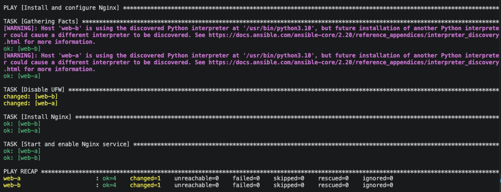

# 7.3. Подъём инфраструктуры в Yandex Cloud — Юклашов

Этот отчет содержит описание процесса развертывания облачной инфраструктуры с помощью Terraform и последующей конфигурации серверов через Ansible.

---

## Задание 1 (Terraform)

В ходе выполнения первой части задания была создана отказоустойчивая сетевая инфраструктура и виртуальные машины в Yandex Cloud.

**Созданные ресурсы:**
*   **VPC (netology-vpc):** Общая сеть для всех ресурсов.
*   **Subnets:** Три подсети в разных зонах доступности (`ru-central1-a`, `ru-central1-b`, `ru-central1-d`).
*   **NAT Gateway:** Для обеспечения выхода в интернет приватных серверов.
*   **Security Groups:**
    *   `bastion-sg`: Разрешает входящий SSH (порт 22) отовсюду.
    *   `web-sg`: Разрешает входящий SSH только с бастион-хоста и входящий HTTP (порт 80) отовсюду.
*   **Виртуальные машины:**
    *   `bastion-vm`: Публичный хост для доступа во внутреннюю сеть.
    *   `web-a`, `web-b`: Веб-серверы в приватных подсетях без публичных IP.

**Полученные IP-адреса:**
*   **Bastion Host (Public IP):** `158.160.117.132`
*   **Web Server A (Internal IP):** `192.168.10.23`
*   **Web Server B (Internal IP):** `192.168.20.10`

### Конфигурация `main.tf`
```hcl
terraform {
  required_providers {
    yandex = {
      source = "yandex-cloud/yandex"
    }
  }
}

# --- Provider ---
provider "yandex" {
  token     = var.yc_token
  cloud_id  = var.yc_cloud_id
  folder_id = var.yc_folder_id
  zone      = var.default_zone
}

# --- Network ---
resource "yandex_vpc_network" "default" {
  name = "netology-vpc"
}

resource "yandex_vpc_subnet" "subnet-a" {
  name           = "subnet-a"
  zone           = "ru-central1-a"
  v4_cidr_blocks = ["192.168.10.0/24"]
  network_id     = yandex_vpc_network.default.id
  route_table_id = yandex_vpc_route_table.nat_route.id
}

resource "yandex_vpc_subnet" "subnet-b" {
  name           = "subnet-b"
  zone           = "ru-central1-b"
  v4_cidr_blocks = ["192.168.20.0/24"]
  network_id     = yandex_vpc_network.default.id
  route_table_id = yandex_vpc_route_table.nat_route.id
}

resource "yandex_vpc_subnet" "subnet-d" {
  name           = "subnet-d"
  zone           = "ru-central1-d"
  v4_cidr_blocks = ["192.168.30.0/24"]
  network_id     = yandex_vpc_network.default.id
  route_table_id = yandex_vpc_route_table.nat_route.id
}

# --- NAT Gateway ---
resource "yandex_vpc_gateway" "nat_gateway" {
  name = "nat-gateway"
  shared_egress_gateway {}
}

resource "yandex_vpc_route_table" "nat_route" {
  name       = "nat-route-table"
  network_id = yandex_vpc_network.default.id

  static_route {
    destination_prefix = "0.0.0.0/0"
    gateway_id         = yandex_vpc_gateway.nat_gateway.id
  }
}

# --- Security Groups ---
resource "yandex_vpc_security_group" "bastion_sg" {
  name        = "bastion-sg"
  description = "Security group for bastion host"
  network_id  = yandex_vpc_network.default.id

  ingress {
    protocol       = "tcp"
    port           = 22
    v4_cidr_blocks = ["0.0.0.0/0"]
    description    = "Allow inbound SSH from anywhere"
  }

  egress {
    protocol       = "any"
    v4_cidr_blocks = ["0.0.0.0/0"]
    description    = "Allow all outbound traffic"
  }
}

resource "yandex_vpc_security_group" "web_sg" {
  name        = "web-sg"
  description = "Security group for web servers"
  network_id  = yandex_vpc_network.default.id

  ingress {
    protocol        = "tcp"
    port            = 22
    security_group_id = yandex_vpc_security_group.bastion_sg.id
    description     = "Allow inbound SSH from bastion host"
  }

  ingress {
    protocol       = "tcp"
    port           = 80
    v4_cidr_blocks = ["0.0.0.0/0"]
    description    = "Allow inbound HTTP from anywhere"
  }

  egress {
    protocol       = "any"
    v4_cidr_blocks = ["0.0.0.0/0"]
    description    = "Allow all outbound traffic"
  }
}

# --- Virtual Machines ---
data "yandex_compute_image" "ubuntu_2004" {
  family = "ubuntu-2204-lts"
}

resource "yandex_compute_instance" "bastion_vm" {
  name        = "bastion-vm"
  platform_id = "standard-v1"
  zone        = "ru-central1-a"

  resources {
    cores  = 2
    memory = 2
  }

  boot_disk {
    initialize_params {
      image_id = data.yandex_compute_image.ubuntu_2004.id
      size     = 10
    }
  }

  network_interface {
    subnet_id          = yandex_vpc_subnet.subnet-a.id
    nat                = true
    security_group_ids = [yandex_vpc_security_group.bastion_sg.id]
  }

  metadata = {
    ssh-keys = "ubuntu:${var.ssh_public_key}"
  }
}

resource "yandex_compute_instance" "web_vm" {
  for_each = {
    "web-a" = yandex_vpc_subnet.subnet-a.id,
    "web-b" = yandex_vpc_subnet.subnet-b.id
  }

  name        = each.key
  platform_id = "standard-v1"
  zone = substr(
    {
      "web-a" = "ru-central1-a",
      "web-b" = "ru-central1-b"
    }[each.key],
    0,
    -1
  )

  resources {
    cores  = 2
    memory = 4
  }

  boot_disk {
    initialize_params {
      image_id = data.yandex_compute_image.ubuntu_2004.id
      size     = 15
    }
  }

  network_interface {
    subnet_id          = each.value
    nat                = false
    security_group_ids = [yandex_vpc_security_group.web_sg.id]
  }

  metadata = {
    ssh-keys = "ubuntu:${var.ssh_public_key}"
  }
}
```

**Скриншот консоли Yandex Cloud с созданными ресурсами:**


---

## Задание 2 (Ansible)

После успешного развертывания инфраструктуры было выполнено конфигурирование целевых серверов (`web-a`, `web-b`) с использованием Ansible.

**Основные моменты реализации:**
*   Доступ к серверам в приватных подсетях организован через `bastion-vm` (используется `ProxyCommand` в конфигурации SSH/Inventory).
*   Установка Nginx выполнена автоматически на оба веб-сервера.
*   Сервис Nginx запущен и добавлен в автозагрузку.

### Inventory (`inventory.ini`)
```ini
[webservers]
web-a ansible_host=192.168.10.23
web-b ansible_host=192.168.20.10

[bastion]
bastion-vm ansible_host=158.160.117.132

[webservers:vars]
ansible_ssh_common_args='-o ForwardAgent=yes -o StrictHostKeyChecking=no -o ProxyCommand="ssh -W %h:%p ubuntu@158.160.117.132 -i ~/.ssh/id_ed25519 -o StrictHostKeyChecking=no"'
ansible_user=ubuntu
```

### Playbook (`playbook.yml`)
```yaml
---
- name: Install and configure Nginx
  hosts: webservers
  become: yes
  gather_facts: yes
  tasks:
    - name: Disable UFW
      ansible.builtin.command: ufw disable
      ignore_errors: true

    - name: Install Nginx
      apt:
        name: nginx
        state: latest
        update_cache: yes

    - name: Start and enable Nginx service
      systemd:
        name: nginx
        state: started
        enabled: yes
```

**Скриншот вывода команды `ansible-playbook`:**

