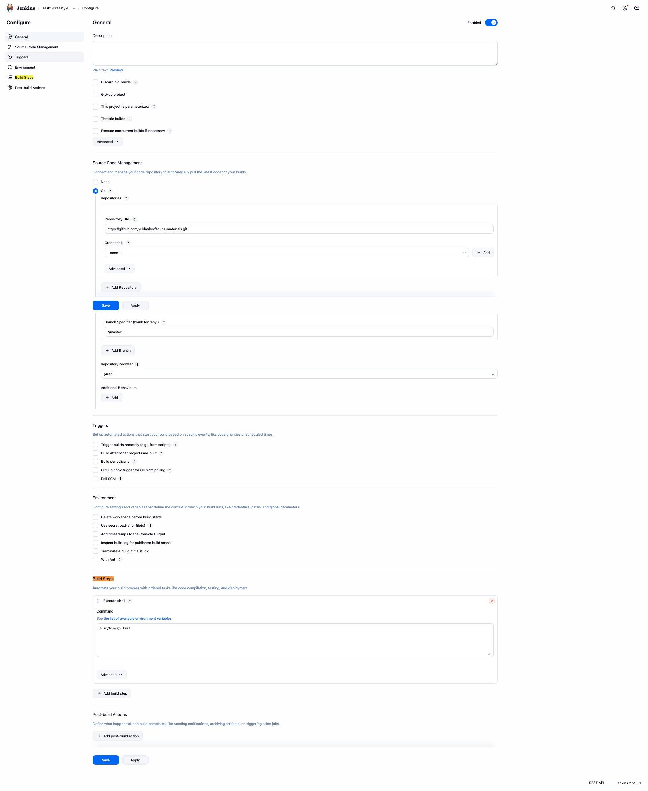
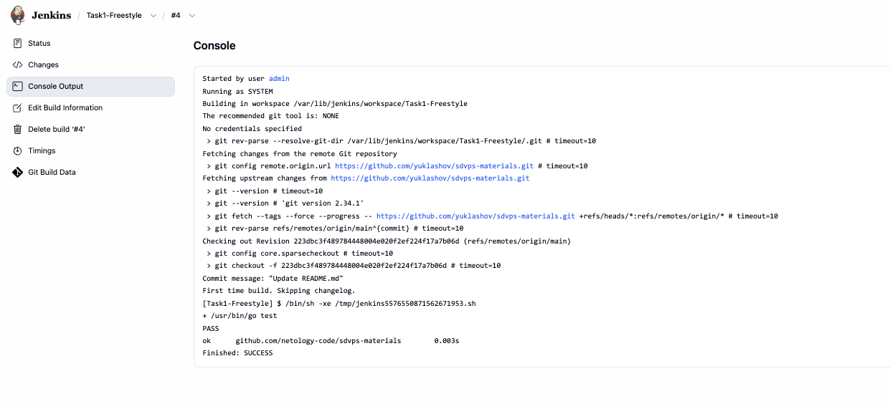
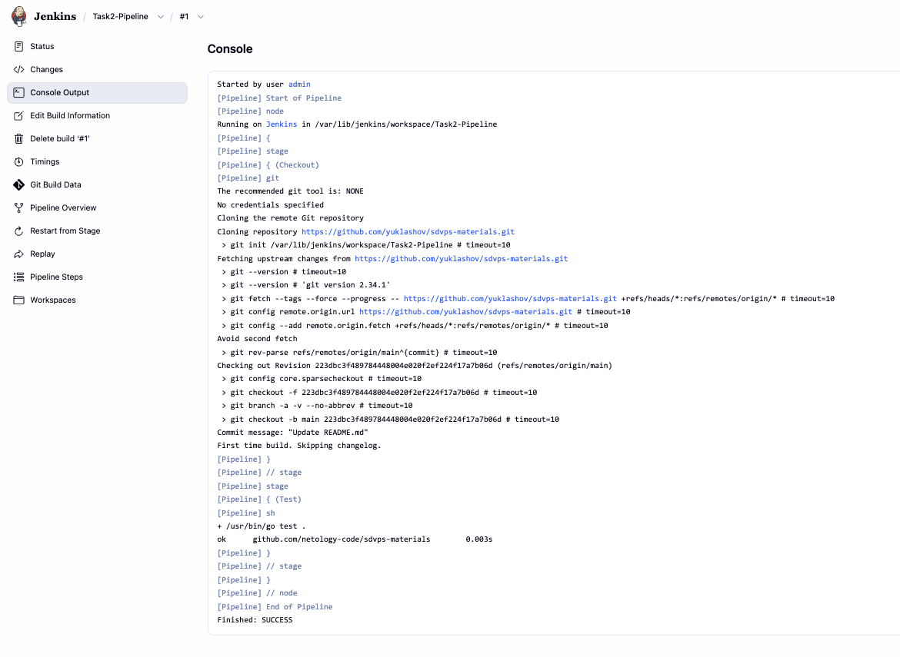
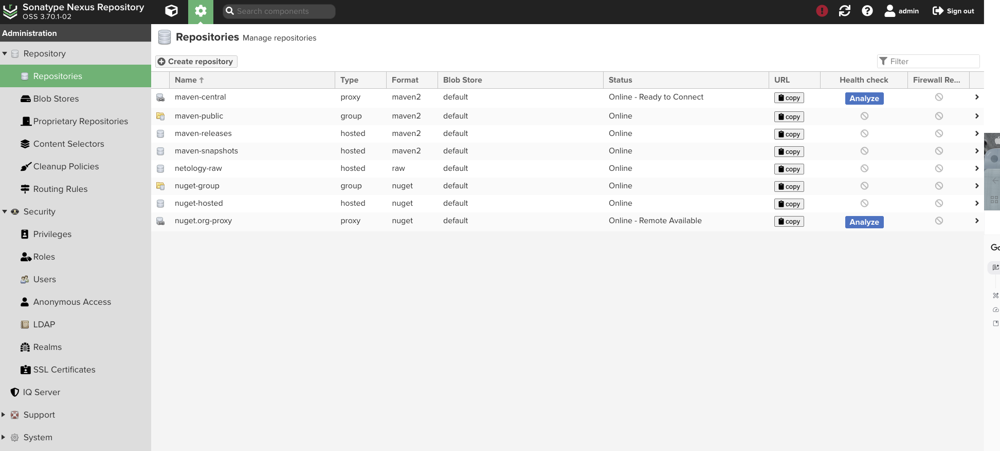
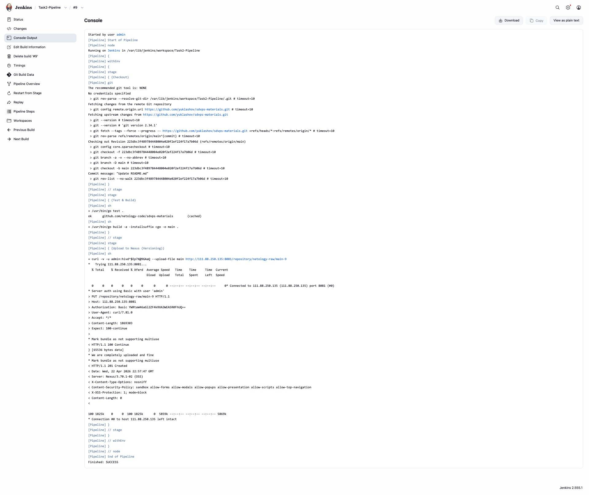
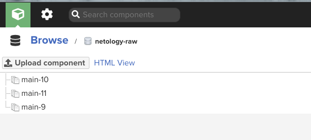

# Домашнее задание к занятию «Что такое DevOps. СI/СD» - 8-02

**Студент:** Yuklashov

## Задание 1. Jenkins Freestyle Project

**Что было сделано:**
- Установил Jenkins на отдельную ВМ.
- Установил Go, так как для тестов репозитория нужен именно он.
- Настроил Freestyle Project: подключил свой форк репозитория и добавил шаг сборки с командой `/usr/bin/go test .`.

Сборка проходит успешно, тесты зеленого цвета.

---

## Задание 2. Declarative Pipeline

**Что было сделано:**
- Перевел ручные настройки из Freestyle проекта в код (Declarative Pipeline). 
- Создал проект типа Pipeline и описал шаги Checkout и Test.

Сборка Pipeline так же проходит без ошибок.

---

## Задание 3 и 4*. Nexus и Версионирование

**Что было сделано:**
- Поднял вторую ВМ и развернул на ней Nexus.
- Создал в Nexus репозиторий типа `raw (hosted)` с названием `netology-raw`.
- Дополнил Jenkins Pipeline шагом компиляции бинарника (`go build`) и загрузки его в Nexus.
- Реализовал Задание 4* (версионирование): для загрузки использовал переменную `${BUILD_NUMBER}`, чтобы каждый новый артефакт получал уникальный номер релиза (main-1, main-2 и т.д.).

Все версии собираются и успешно загружаются в репозиторий Nexus.

